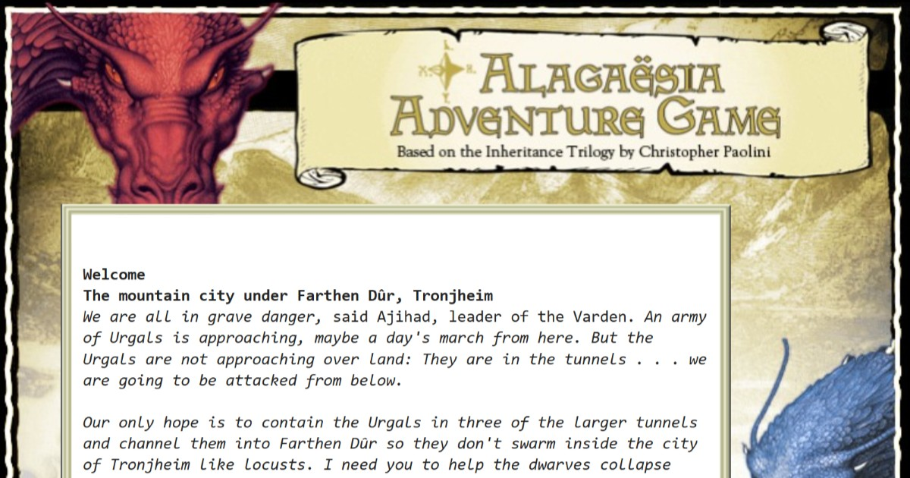

# Alagaësia Adventure Game

This is a restoration of the Alagaësia text adventure game that was originally available on alagaesia.com between 2005 and 2018 (though it became non-functional in its final years).

Most of the assets used here were preserved by the Wayback Machine, with the notable exception of the `.z5` game file, which was crucially provided by Paul O'Brian. (Paul wrote a very critical [review](https://inventory.superverbose.com/2022/05/30/eragon-by-unknown-if-review/) of this game in 2006.)

Some adaptations have been made to ensure compatibility with modern browsers—for example, using [Parchment](https://iplayif.com/) instead of ZPlet, eliminating browser popups, and improving the website's responsiveness. 

Christopher Paolini has approved this restoration being shared.

# [Play the Game Here](https://ibid-11962.github.io/Alagaesia-Adventure-Game/)